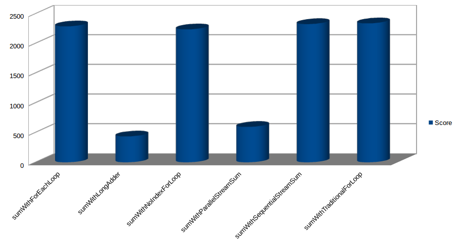

# JMH Benchmarks For Java Loops
This repo uses the [Java Microbenching Harness](http://openjdk.java.net/projects/code-tools/jmh/) to ascertain whether there is much of a performance difference between the different loop styles in Java. Primarily we are looking at the below three ways of iterating over a collection in Java.
  * The traditional for loop:
  ```java
    for (int i = 0; i < coll.size(); i++) {
      System.out.println(coll.get(i));
    }
  ```
  * The for-each loop:
  ```java
    for(Object obj : collection) {
      System.out.println(obj);
    }
  ```
  * Java 8 streams:
  ```java
    System.out.println(collections.stream().sum());
  ```
  
To execute the test yourself simply run up to verify phase in maven:    
    ```mvn clean verify```

The results of running the enclosed tests on my laptop are below.   
Laptop specs:    
  * CPU: Intel(R) Core(TM) i7-4810MQ CPU @ 2.80GHz
  * RAM: 23 Gigs
  
JMH Results:

|Benchmark                 |   (size) |        Score  |        Error | Units |
| ------------------------ | -------- | ------------- | ------------ | ----- |
|sumWithForEachLoop        |      100 | 29290281.628  |± 3986632.466 | ops/s |
|sumWithForEachLoop        |    10000 |   355980.611  |±   53354.943 | ops/s |
|sumWithForEachLoop        |  1000000 |     2288.345  |±     168.875 | ops/s |
|sumWithLongAdder          |      100 |   450882.604  |±   12558.923 | ops/s |
|sumWithLongAdder          |    10000 |    39001.347  |±    5677.534 | ops/s |
|sumWithLongAdder          |  1000000 |      435.604  |±      83.604 | ops/s |
|sumWithNoIndexForLoop     |      100 | 37514487.562  |± 3139770.944 | ops/s |
|sumWithNoIndexForLoop     |    10000 |   416382.455  |±   67468.493 | ops/s |
|sumWithNoIndexForLoop     |  1000000 |     2237.584  |±     147.402 | ops/s |
|sumWithParallelStreamSum  |      100 |    665949.231 |±  117700.186 | ops/s |
|sumWithParallelStreamSum  |    10000 |     94931.974 |±   26402.050 | ops/s |
|sumWithParallelStreamSum  |  1000000 |       595.496 |±     127.436 | ops/s |
|sumWithSequentialStreamSum|      100 |  22695604.665 |± 2935118.414 | ops/s |
|sumWithSequentialStreamSum|    10000 |    317384.953 |±   65154.225 | ops/s |
|sumWithSequentialStreamSum|  1000000 |      2326.198 |±     188.996 | ops/s |
|sumWithTraditionalForLoop |      100 |  38974158.442 |± 6922646.345 | ops/s |
|sumWithTraditionalForLoop |    10000 |    357671.584 |±   87281.679 | ops/s |
|sumWithTraditionalForLoop |  1000000 |      2338.859 |±     185.722 | ops/s |


